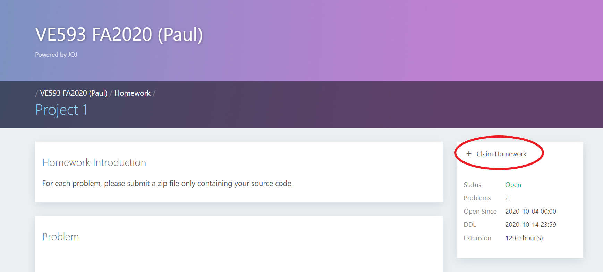
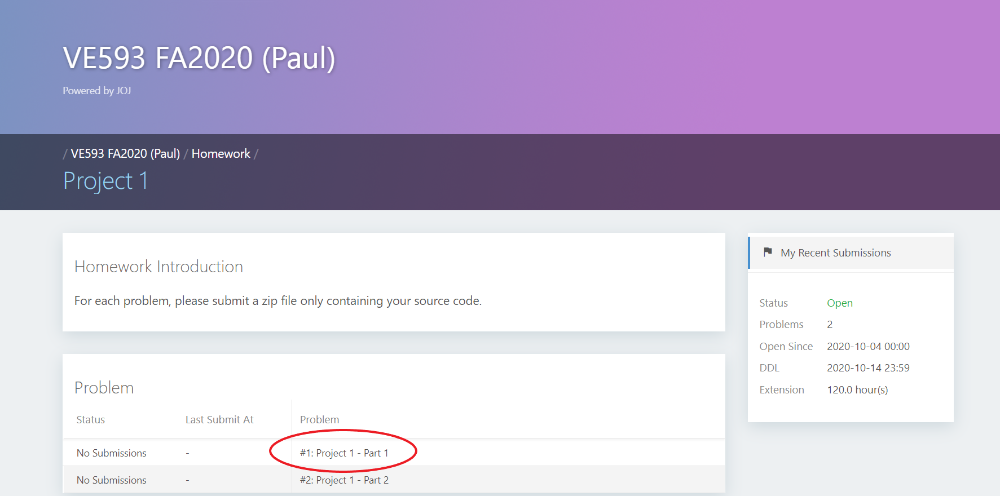

## Submit your VE593 project solution to Joint Online Judge (JOJ)

### 1. Join JOJ

* You may need to log in your jAccount first.

- Students can join the VE593 domain on JOJ by visiting the following URL: 
<https://joj.sjtu.edu.cn/d/ve593_fall_2020/join> and type in the invitation code provided in the announcement.

### 2. Choose a project

- On the "Main" page or "Homework" page, you can see a list of homework. Though some homework is visible, the content is disabled. For now, please click "Project 1".

  

- Please click "Claim Homework" on the project page.

  

### 3. Submit your solution

- Once you've finished the lab, please compress your code into a zip file and submit it to JOJ.
- __Note__ that the problem is not visible till the time it releases. Open the project page again and click Problem #1: "Project 1 - Part 1". 

  

- Click "Submit" on the problem page. 

  

- Select your zip file and click "Submit". Please do not submit your source code directly.

  

### 4. View the submission result

- After your submission, the grading results will be automatically displayed. If your solution is not "Accepted" for any test case, please try to debug and improve your solution, then submit it again. You have unlimited chances for submission. Please notice this is only a pretest with 5 test cases. After the due date of the project, TAs will run the complete test suite which contains other cases. We strongly encourage you to design your own test suite and take every corner case into consideration. Good Luck!

  

### Acknowledgement

- Special thanks to [Yihao Liu](https://github.com/tc-imba) for developing JOJ. The project repository is <https://github.com/joint-online-judge/cb4>.
- Thanks to [Zian Ke](https://github.com/zianke) for [VE280 JOJ submission tutorials](https://github.com/ve280/tutorials/blob/master/joj_project_submission.md).